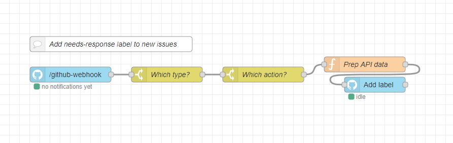

# GitHub Nodes

<a href="https://nodered.org" target="_blank">Node-RED</a> nodes to interact with <a href="https://github.com/" target="_blank">GitHub</a>.

## Install

Run the following command in the root directory of your Node-RED instance:

```
npm install --save node-red-contrib-github-plus
```

## Usage

This set provides 2 nodes:

- `github-rest-api` - a GitHub REST API client node. It makes REST API requests by sending `msg.payload` data to the specified API endpoint and outputs the response data as `msg.payload`.
- `github-webhook` - a GitHub Webhook listener node. It listens to GitHub webhooks and outputs the event name as the `msg.topic` and the event payload object as the `msg.payload`.

### Configuration

#### Setting Up GitHub API Client

Before making any API requests, you have to create a GitHub App. To do that follow the steps as per [Creating a GitHub App](https://docs.github.com/en/free-pro-team@latest/developers/apps/creating-a-github-app) guide:

- create app and enter the basic info (steps 1 - 7)
- skip the User authorization steps (8 - 11). The app is private and will be used to do automated things on its own. It doesn't need any user auth logic.
- skip the Webhook steps (12 - 13) - will set it up later
- specify permissions (step 14)
- skip the events subscription (step 15) - will set it up later with the webhook
- for "Where can this integration be installed?" set **Only on this account** (step 16)
- push **Create GitHub App**
- once created, you will be redirected to the App Settings page. There is the **App ID** number in the About section. You will need this number later.

Then you need to generate a private key:

1. In the App settings scroll down to **Private keys**
2. Click **Generate a private key**
3. You should see a private key in `.PEM` format downloaded to your computer

Now you need to install the app on your repository(-ies). To do that follow the [Installing your private GitHub App on your repository](https://docs.github.com/en/free-pro-team@latest/developers/apps/installing-github-apps#installing-your-private-github-app-on-your-repository) guide:

- once installed, you will be redirected to the configuration options for the app installation. The url of the installation config page should look like `https://github.com/.../settings/installations/<InstID>`. You will need the `<InstID>` number later.

And finally configure your GitHub API client:

1. Open your Node-RED instance
2. Drag & drop the `github-rest api` node from the palette to the workspace and double-click on it, to open the node editor
3. In the `Client` dropdown menu pick the `Add New github-api-config` option and press the pencil button at the right to add a new API configuration
4. Copy-paste `App ID` from the App Settings page on GitHub to the node editor
5. In the `Private Key` open the `.PEM` key file you downloaded from GitHub
6. Copy-paste `Inst ID` from the app installation config page url to the node editor
7. In then `User-Agent` enter your username or the name of your GitHub Application. Empty value defaults to `node-red-contrib-github-plus`. [Read more](https://docs.github.com/en/rest/overview/resources-in-the-rest-api#user-agent-required) why it is required.
8. Push `Update`

#### Setting Up GitHub Webhooks

To listen for GitHub events, you first need to start a webhook listener on your server:

1. Open your Node-RED instance
2. Drag & drop the `github-webhook` node from the palette to the workspace and double-click on it, to open the node editor
3. In the `Path` field set the url path the webhook listener will listen to notifications on.
4. Push `Generate Secret` - you'll need the secret later
5. Push `Update`
6. `Deploy`

Now you need to setup a webhook on GitHub to send event notifications to your server. Follow the steps from [Creating webhooks](https://docs.github.com/en/free-pro-team@latest/developers/webhooks-and-events/creating-webhooks) guide. Here are some tips:

- if the app will be doing the same things for all repos it installed on, then setup a webhook in your GitHub App or Organization settings
- if the app will have different logic from repo to repo, then setup a webhook in Repository settings
- content type should be `application/json` - this is the content type used by `github-webhook` node
- webhook url should be the url to the webhook listener on your server
- webhook secret should be the `Secret` value you generated above

### Making REST API Requests

To make REST API requests using the `github-rest-api` node, select API client you added and set the API endpoint the node will call. The API endpoint can be either specified in the node settings, or provided in `msg.endpoint` (if the endpoint is empty in the node settings). The request parameters are set via the `msg.payload`.

After executing a request the node outputs a message with the response data set to `msg.payload`.

If an API endpoint is in Preview mode and requires a Media Type to be set in the Accept header, then specify it in the Media Type node setting or via `msg.mediaType` (if the node setting is empty).

### Handling Incoming Webhook Payloads

When GitHub sends an event notification to the url where you setup a webhook node to listen on, it will trigger the node output with the following properties:

- `msg.guid` - GUID to identify the delivery. Value of `X-GitHub-Delivery` header.
- `msg.topic` - Name of the event that triggered the delivery. Value of `X-GitHub-Event` header.
- `msg.payload` - Webhook event payload.

## Example

### Adding Label To New Issues

This example flow adds a `needs-response` label to all new issues opened in the repository where the app is installed.



Flow json for Node-RED: [github-adding-label-to-new-issues.json](examples/github-adding-label-to-new-issues.json)

## References

- REST API Reference: https://docs.github.com/en/free-pro-team@latest/rest/reference
- REST API Endpoints available for GitHub Apps: https://docs.github.com/en/free-pro-team@latest/rest/overview/endpoints-available-for-github-apps
- REST API Media Types: https://docs.github.com/en/free-pro-team@latest/rest/overview/media-types
- Webhook events and payloads: https://docs.github.com/en/free-pro-team@latest/developers/webhooks-and-events/webhook-events-and-payloads

## Backers 💝

[](https://mynode.redbtc.org/gh-backer/top/0/profile)
[](https://mynode.redbtc.org/gh-backer/top/1/profile)
[](https://mynode.redbtc.org/gh-backer/top/2/profile)
[](https://mynode.redbtc.org/gh-backer/top/3/profile)
[](https://mynode.redbtc.org/gh-backer/top/4/profile)
[](https://mynode.redbtc.org/gh-backer/top/5/profile)
[](https://mynode.redbtc.org/gh-backer/top/6/profile)
[](https://mynode.redbtc.org/gh-backer/top/7/profile)
[](https://mynode.redbtc.org/gh-backer/top/8/profile)
[](https://mynode.redbtc.org/gh-backer/top/9/profile)

[[Donate](https://mynode.redbtc.org/gh-donate)] Thank you for your support! 🙌

## Developing Nodes

Build & Test in Watch mode:

```
yarn dev
```

## Testing Node Set in Node-RED

[Read Node-RED docs](https://nodered.org/docs/creating-nodes/first-node#testing-your-node-in-node-red) on how to install the node set into your Node-RED runtime.

## License

MIT © Alex Kaul
